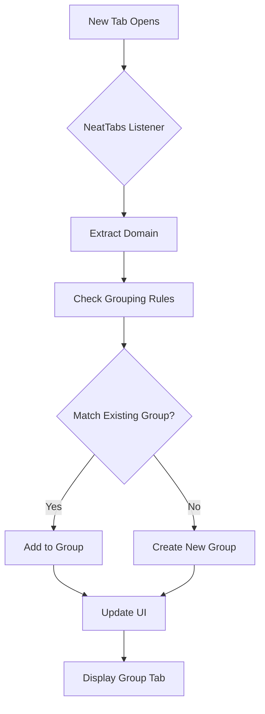

# NeatTabs: Automatically Organize Your Chrome Tabs by Website

[](https://chrome.google.com/webstore/detail/neattabs/)
[](LICENSE)
[](#)
[](https://github.com/bhushan4/NeatTabs/stargazers)


## 🌟 Why NeatTabs?

Tired of tab overload? NeatTabs is a smart Chrome extension that **automatically groups tabs from the same website** into organized, collapsible groups. It understands that `mail.google.com`, `drive.google.com`, and `docs.google.com` are all part of your "Google" workspace - and groups them intelligently!

---

## ✨ Features

### 🧠 Smart Grouping Intelligence
- **Domain-based grouping**: All `*.google.com` tabs become one "Google" group
- **Exception awareness**: `news.ycombinator.com` stays separate from `ycombinator.com`
- **Multi-language support**: `en.wikipedia.org`, `fr.wikipedia.org` = one Wikipedia group

### 🎨 Beautiful Interface
- **Visual group tabs** with website favicons
- **Clean dropdown** with all grouped tabs
- **Color-coded** groups (optional)
- **Smooth animations** when expanding/collapsing

### ⚡ Performance Focused
- **Lightweight**: < 2MB total size
- **Smart suspension**: Sleep inactive tabs to save memory
- **Instant response**: Grouping happens in real-time
- **Zero-config**: Works immediately after install

### 🔧 Fully Customizable
- **Adjust grouping sensitivity** (aggressive ↔ conservative)
- **Create exception lists** for sites that shouldn't group
- **Choose visual themes** for group tabs
- **Keyboard shortcuts** for power users

---

## 🚀 Installation

### Option 1: Chrome Web Store (Recommended)
1. Visit the [Chrome Web Store page](#)
2. Click "Add to Chrome"
3. Confirm installation
4. Start browsing - grouping happens automatically!

### Option 2: Manual Installation (Developer)
```bash
# Clone the repository
git clone https://github.com/bhushan4/NeatTabs.git
cd NeatTabs

# Load in Chrome:
# 1. Open Chrome and go to chrome://extensions/
# 2. Enable "Developer mode" (toggle in top-right)
# 3. Click "Load unpacked"
# 4. Select the NeatTabs folder
```

---

## 📖 How to Use

### Basic Usage
1. **Install the extension**
2. **Browse normally** - NeatTabs works automatically!
3. **Click any group tab** to see all tabs in that website
4. **Select a tab** from the dropdown to switch to it

### Advanced Features
- **Right-click** any tab for grouping options
- **Drag & drop** tabs between groups
- **Pin important tabs** to keep them separate
- **Use keyboard shortcuts** for quick navigation

### Keyboard Shortcuts
| Shortcut | Action |
|----------|--------|
| `Alt+Shift+G` | Toggle grouping on/off |
| `Alt+Shift+O` | Open group panel |
| `Alt+Shift+P` | Pin/unpin current tab |
| `Alt+Shift+E` | Open settings |

---

## 🏗️ Architecture



### Core Components
- **`background.js`** - Main service worker for tab management
- **`content.js`** - Page analysis and favicon extraction
- **`popup.html/js`** - Settings panel and group management
- **`manifest.json`** - Extension configuration

---

## 🛠️ Development

### Prerequisites
- Chrome Browser (v88+)
- Basic knowledge of JavaScript
- (Optional) Node.js for build tools

### Building from Source
```bash
# Install dependencies
npm install

# Development build with watch mode
npm run dev

# Production build
npm run build

# Create ZIP for Chrome Web Store
npm run package
```

### Project Structure
```
NeatTabs/
├── icons/                 # Extension icons (16x16 to 128x128)
├── static/               # Static assets
├── manifest.json         # Extension manifest
├── background.js         # Main service worker
├── content.js           # Content scripts
├── popup.html           # Settings popup
├── popup.js             # Popup logic
├── options.html         # Options page
└── README.md           # This file
```

---

## 🤝 Contributing

We love contributions! Here's how you can help:

1. **Fork** the repository
2. **Create a feature branch** (`git checkout -b feature/AmazingFeature`)
3. **Commit your changes** (`git commit -m 'Add some AmazingFeature'`)
4. **Push to the branch** (`git push origin feature/AmazingFeature`)
5. **Open a Pull Request**

### Development Guidelines
- Follow JavaScript ES6+ standards
- Add comments for complex logic
- Update documentation for new features
- Test changes in Chrome before submitting

### Reporting Issues
Found a bug? Please include:
1. Chrome version
2. NeatTabs version
3. Steps to reproduce
4. Expected vs actual behavior

---

## 📄 License

Distributed under the MIT License. See `LICENSE` for more information.

---

## 🙏 Acknowledgments

- **Chrome Extensions API** - For making tab management possible
- **Favicon.io** - For favicon extraction techniques
- **Contributors** - Everyone who helps improve NeatTabs
- **You** - For using NeatTabs!

---

## 📞 Support

- **Email**: [bhushan@example.com](mailto:bhushanvit@gmail.com)

---

## 🚀 Quick Links

- [Chrome Web Store](#)
- [Privacy Policy](PRIVACY.md)
- [Changelog](CHANGELOG.md)
- [Contributing Guidelines](CONTRIBUTING.md)
- [Code of Conduct](CODE_OF_CONDUCT.md)

---

<div align="center">

### Made with ❤️ for tab hoarders everywhere

**Star this repo if you find it useful!**

[](https://star-history.com/#bhushan4/NeatTabs&Date)

</div>
